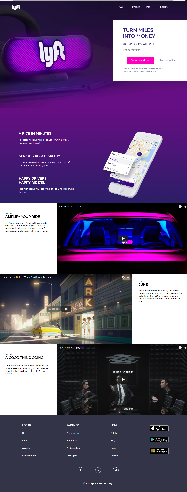

# Code Review - Sprint 3

Maquetación de la portada de la página web de la empresa Lyft.

## Descripción del proyecto

Consta de 5 secciones:

* Header: Ubicación del menú de toda la página.
* Registro: Formulario de ingreso para los nuevos conductores o para inicio de sesión si ya se está registrado.
* Información General: Ventajas de contar con el servicio de Lyft.
* Videos: Videos con información de la experiencia Lyft.
* Footer: Menú, redes sociales e información general.

## Eventos utilizados

Se utilizaron los eventos: onclick, onblur, onfocus, en este proyecto.

## Lanzamiento 

Esta es la versión final revisada del proyecto Lyft.

Hacer click aquí: <a href="https://naovillaj.github.io/CodeReview3">Lyft</a>

## Desarrollado con

Sublime y Atom

* [HTML5] - Para la estructura de la página web
* [CSS3] - Para darle el estilo a la página web
* [JavaScript 1.8.5.] - Para las funcionalidades de la página web

## Autores

* **Squad: Style Coders** 

